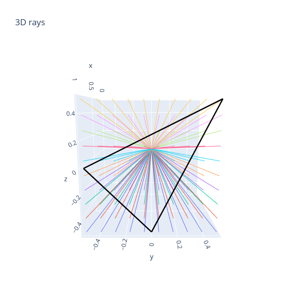
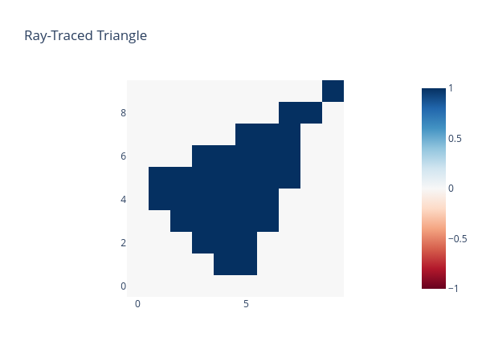
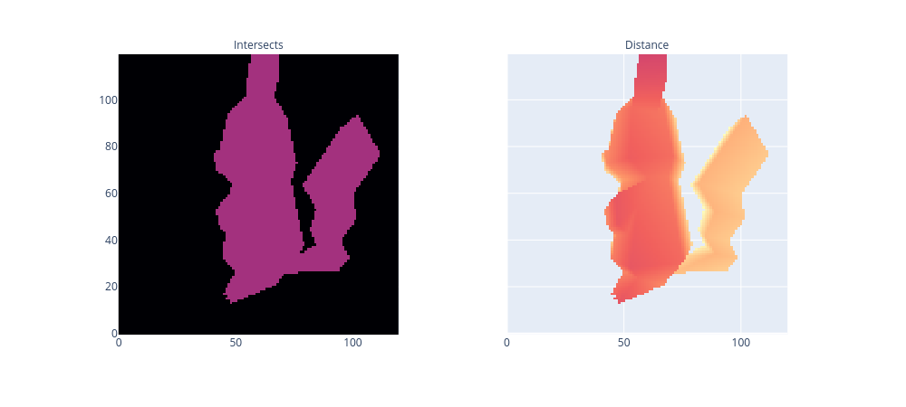

# Ray-Tracing
This is a reproduction of Callum McDougall's [ARENA program.](https://arena-ch1-transformers.streamlit.app/). 

The main file for this code is <b>raytracing.py</b>, the other files are just for learning purpose.

## Execution

To execute this code, first run the following commands in the same folder:
```
git clone git@github.com:callummcdougall/ARENA_3.0.git
git clone git@github.com:niyarrbarman/ray-tracing.git
```

The file structure should look like this:
```
📂parent-folder
 ┣ 📂ARENA_3.0
 ┗ 📂ray-tracing
``` 

Once done, run the following commands:

```
pip3 install -r requirements.txt
python3 raytracing.py
```
## Outputs


